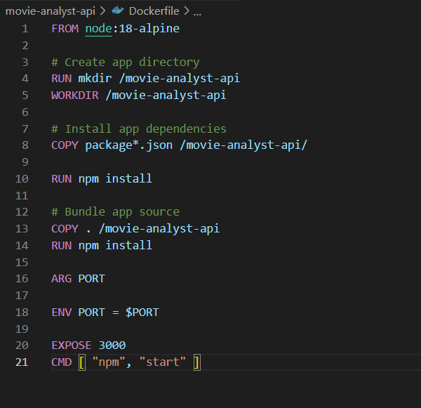
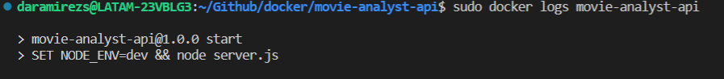
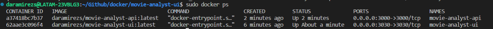
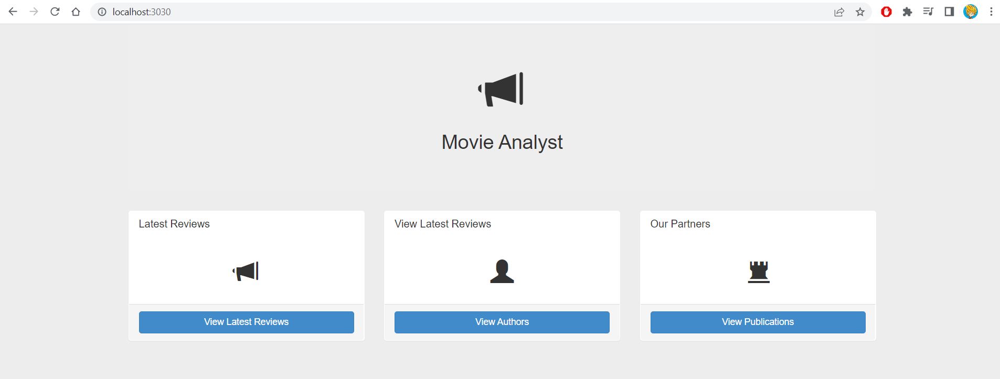
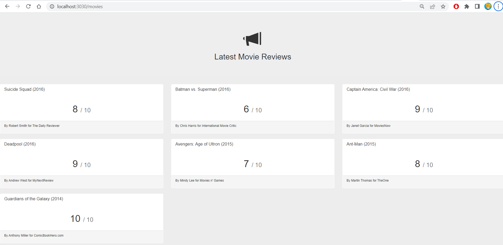
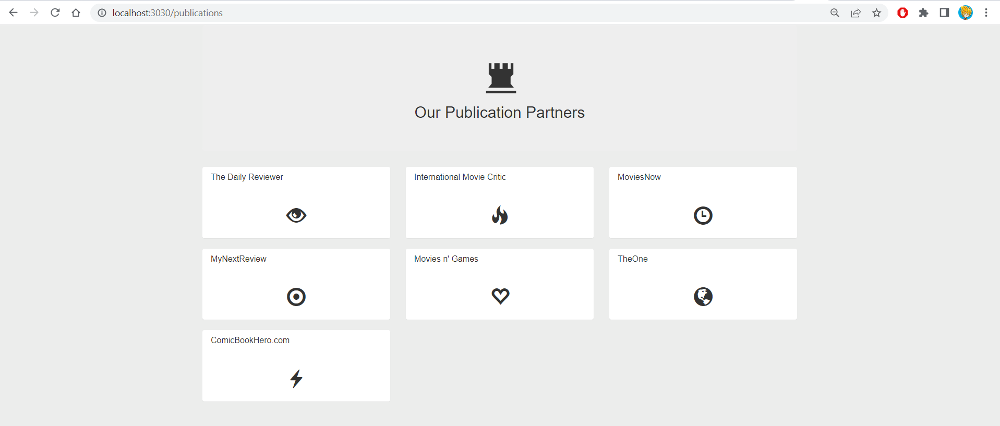
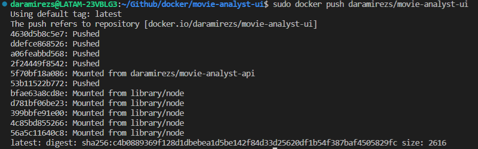
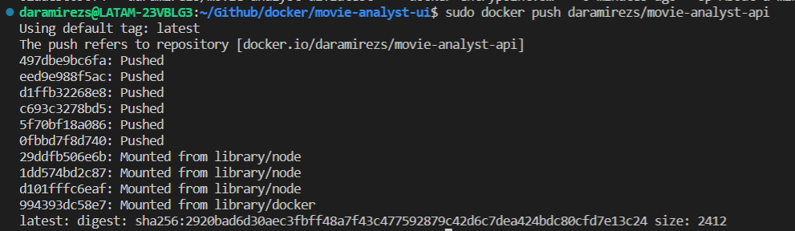
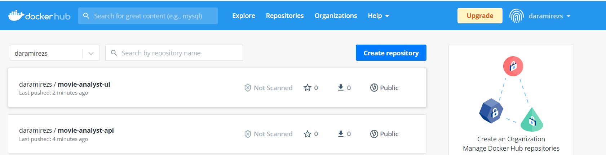

# Download the todo-app repos and add Dockerfiles.


## Fork the repository in Github.


## Clone the repository in you local machine. 
```
$ git clone <\repository_url>
```
## Create a Dockerfile to frontend service.


## Build the frontend dockerfile.
```
$ docker build -t daramirezs/auth-kube:1.0 -t daramirezs/auth-kube:latest .
```
## Run the frontend image.
```
$ sudo docker run -e PORT="8080" -e AUTH_API_ADDRESS="<service_domain>:<port> " -e TODOS_API_ADDRESS="http://<service_domain>:<port>" -e ZIPKIN_URL=" <service_domain>:<port> " --name frontend-kube -p 8040:8040 -d daramirezs/frontend:1.0
```


## Create a Dockerfile to auth service.



## Build the movie-analyst-api dockerfile.

$ docker build -t daramirezs/movie-analyst-api:1.0 -t daramirezs/movie-analyst-api:latest .


## Run movie-analyst-api image.

$ docker run -e PORT=3000 --name movie-analyst-api -p 3000:3000 -d daramirezs/movie-analyst-api:latest



# Run synchronously ensuring that the API is responding to all the UI requests.

Once both dockers are running we just need to check that the ports are well binding and test the application.




## Latest Reviews



## Partners




# Upload both images to any container Registry such as Docker Hub 

## Requirements

* Docker account [logged in your shell](https://stackoverflow.com/questions/57108005/login-to-docker-hub-by-command-line) 

[Docker](https://docs.docker.com/docker-hub/repos/) Hub repositories allow you share container images with your team, customers, or the Docker community at large.

To push an image to Docker Hub, you must first name your local image using your Docker Hub username and the repository name that you created through Docker Hub on the web.

$ docker push -a <\hub-user>/<\repo-name>:<\tag>

## Movie analyst ui


## Movie analyst api



## Dockerhub


