# Download the todo-app repos and add Dockerfiles.


## Fork the repository in Github.

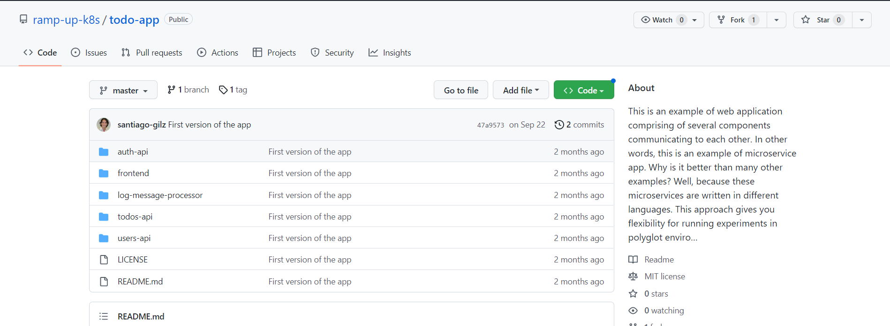

## Clone the repository in you local machine. 
```
$ git clone <\repository_url>
```
## Create a Dockerfile to frontend service.

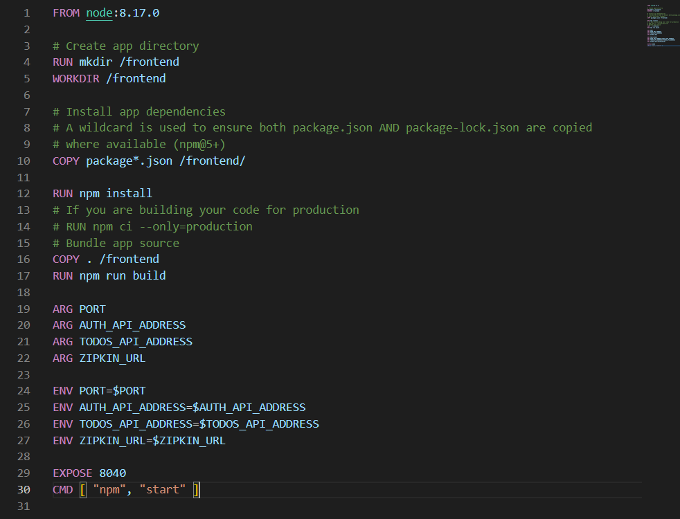

## Build the frontend Dockerfile.
```
$ docker build -t daramirezs/auth-kube:1.0 -t daramirezs/auth-kube:latest .
```
## Run the frontend image.
```
$ sudo docker run -e PORT="8080" -e AUTH_API_ADDRESS="<service_domain>:<port> " -e TODOS_API_ADDRESS="http://<service_domain>:<port>" -e ZIPKIN_URL=" <service_domain>:<port> " --name frontend-kube -p 8040:8040 -d daramirezs/frontend:1.0
```

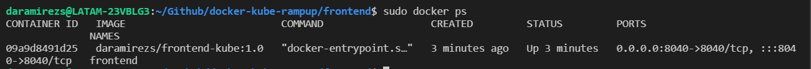

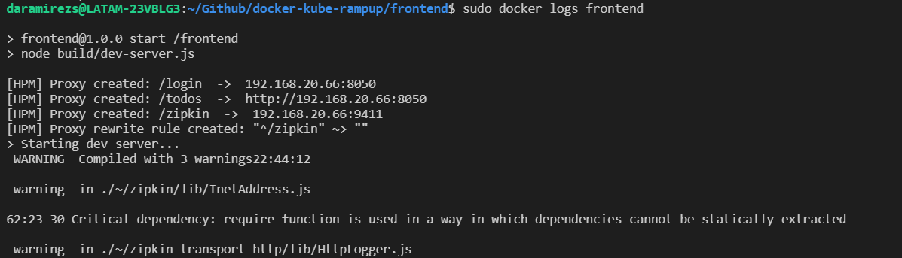

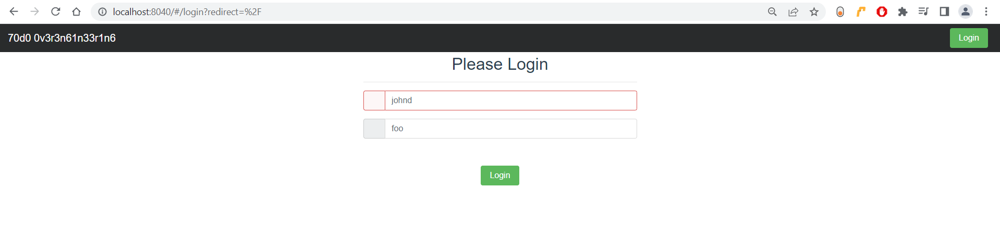

## Create a Dockerfile to auth service.


## Build the auth Dockerfile.
```
$ docker build -t daramirezs/auth-kube:1.0 -t daramirezs/auth-kube:latest .
```

## Run auth image.
```
$ sudo docker run -e JWT_SECRET="<secret>" -e USERS_API_ADDRESS="<service_domain>:<port>" -e "AUTH_API_PORT=<port>" -e ZIPKIN_URL="http://<service_domain>:<port>/api/v2/spans" --name auth-kube -p 8050:8050 -d daramirezs/auth-kube:1.0
```
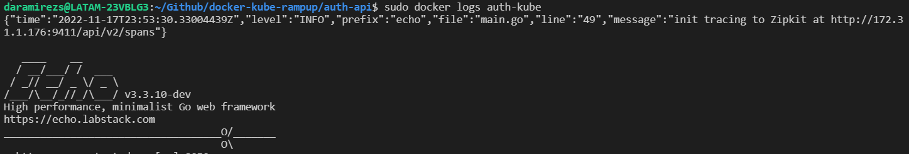

## Build the users Dockerfile.
```
$ docker build -t daramirezs/users-kube:1.0 -t daramirezs/users-kube:latest .
```

## Run users image.
```
$ sudo docker run -e JWT_SECRET="<secret>" -e SERVER_PORT="<port>" --name users-kube -p 8045:8045 -d daramirezs/users-kube:1.0
```

## Build the todos Dockerfile.
```
$ docker build -t daramirezs/todos-kube:1.0 -t daramirezs/todos-kube:latest .
```

## Run todos image.
```
$ sudo docker run -e JWT_SECRET="<secret>" -e REDIS_HOST="<redis_ip>" -e REDIS_PORT="<port>" -e REDIS_CHANNEL="log_channel" -e "TODO_API_PORT=8060" -e USERS_API_ADDRESS="http://<service_domain>:<port>" -e AUTH_API_PORT="<port>" -e ZIPKIN_URL="http://<service_domain>:<port>/api/v2/spans" --name todos-kube -p 8045:8045 -d daramirezs/todos-kube:1.0
```

## Build the log-message-processor Dockerfile.
```
$ docker build -t daramirezs/message-processor-kube:1.0 -t daramirezs/message-processor-kube:latest .
```

## Run message-processor image.
```
$ sudo docker run -e REDIS_HOST="192.168.20.66" -e REDIS_PORT="6379" -e REDIS_CHANNEL="log_channel" --name message-processor-kube -d daramirezs/message-processor-kube:1.0
```

# Upload images to any container Registry such as Docker Hub 

## Requirements

* Docker account [logged in your shell](https://stackoverflow.com/questions/57108005/login-to-docker-hub-by-command-line) 

[Docker](https://docs.docker.com/docker-hub/repos/) Hub repositories allow you share container images with your team, customers, or the Docker community at large.

To push an image to Docker Hub, you must first name your local image using your Docker Hub username and the repository name that you created through Docker Hub on the web.
```
$ docker push -a <\hub-user>/<\repo-name>:<\tag>
```
## Push frontend image
```
$ docker push -a daramirezs/frontend-kube --all-tags
```
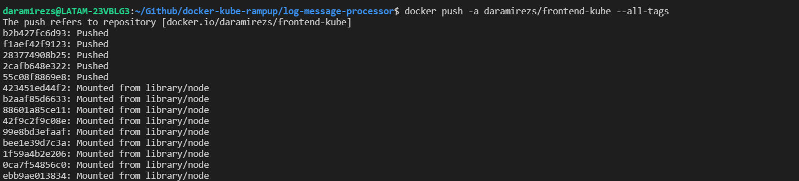

## Push auth image
```
$ docker push -a daramirezs/frontend-kube --all-tags
```
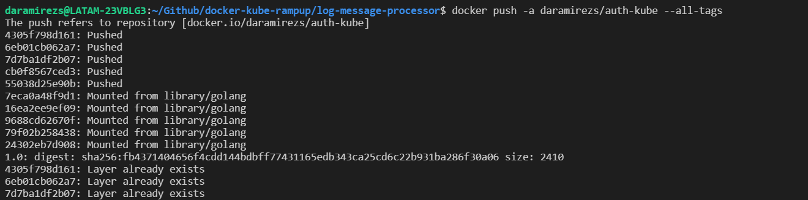

## Push users image
```
$ docker push -a daramirezs/frontend-kube --all-tags
```
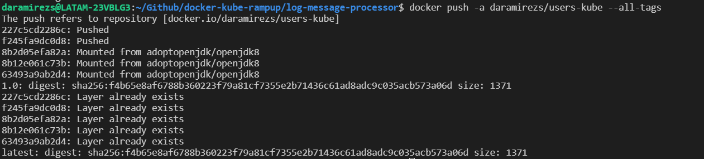

## Push todos image
```
$ docker push -a daramirezs/frontend-kube --all-tags
```
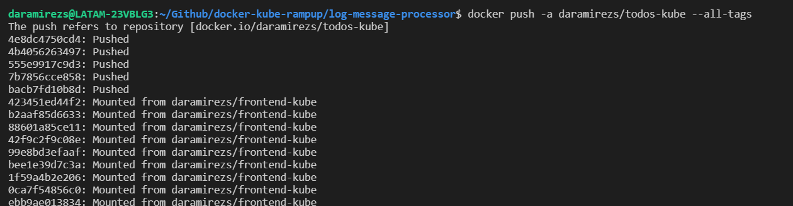

## Push log-message-processor image
```
$ docker push -a daramirezs/frontend-kube --all-tags
```
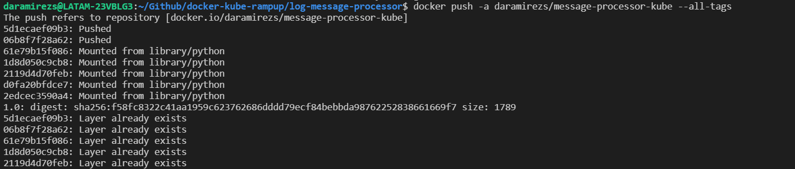
