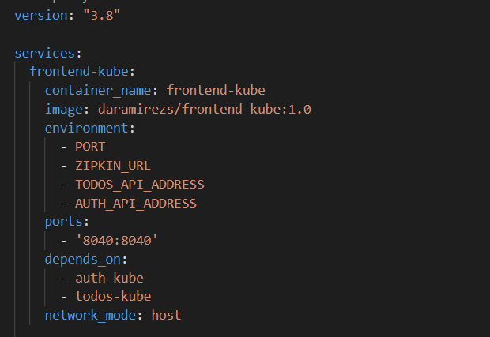
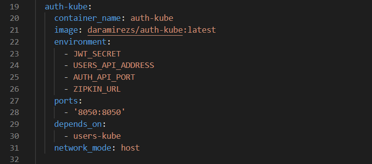
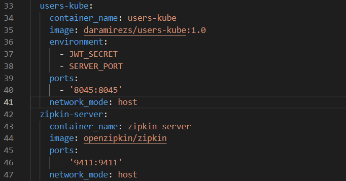
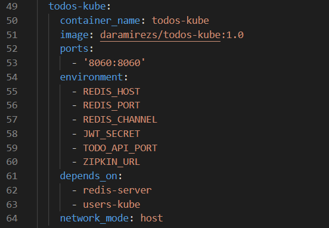
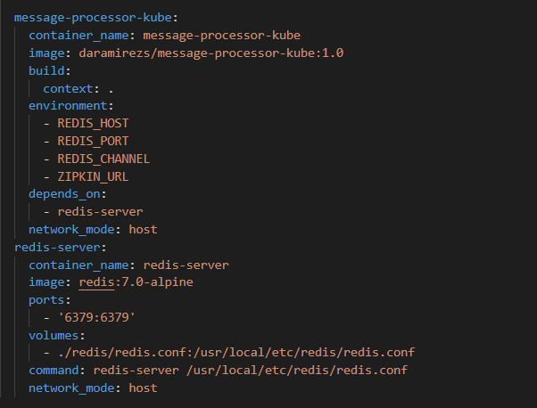
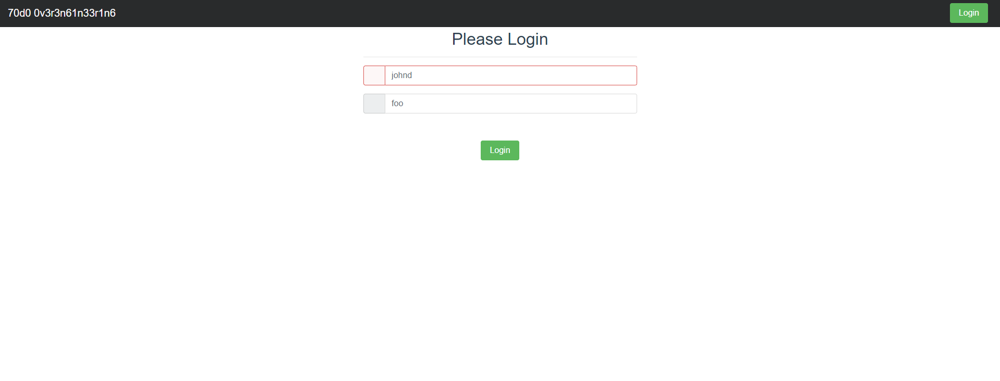
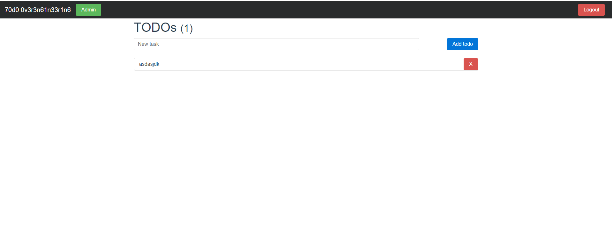
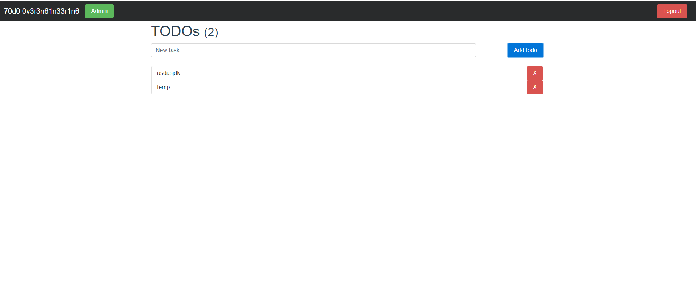

# Sync your containers using Docker Compose. 

Once we create our Dockerfiles, we can sync our containers with Docker compose. 

## Requirements

* docker service running on local

## Create frontend docker-compose

Here we pull from DockerHub our frontend image and define environment variables to do the port forwarding. We defined the `network_mode` to share the same networking space with the Host, and depends_on to set the order in which services must start and stop.

## Create auth docker-compose
Same for this docker-compose 

## Create users docker-compose

## Create todos docker-compose

## Create log-message-processor docker-compose

## Tests

### Frontend

### Todo app

### Add task

# Manage several environments 
Docker Compose streamlines many development workloads based on multi-container implementations. However, running an application on production means running several container instances. This doesn’t fully address the additional challenges of scalability or reliable performance.

## Open ports
We need a way for the containers to communicate with each other as well as if you are building a web application, with the host. That’s why we opened the required ports. 

## Volumes
Setting up volumes is an important part of any docker development environment. You want any changes you make to be reflected inside your container immediately. So, in our setup, we need to mount a few volumes to our database (for example) and one working directory to our app container. 

Pros
Cons
* You can’t replace a container without downtime. No rolling updates are available.

