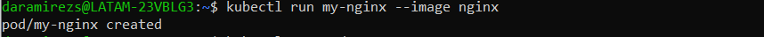
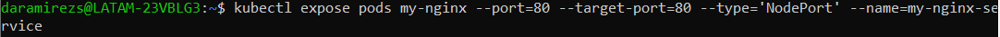
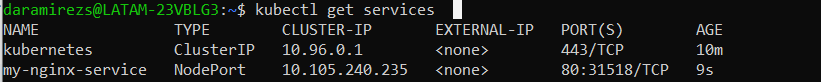
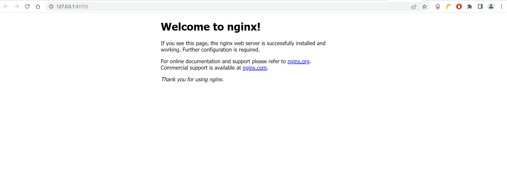
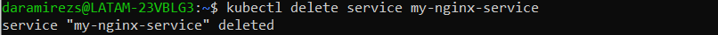
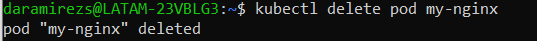
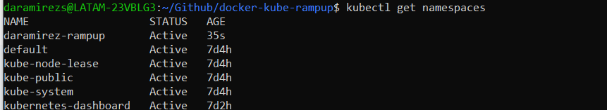
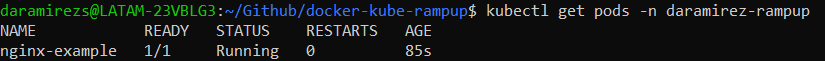
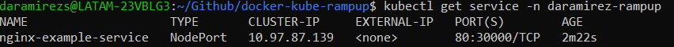

# Complete Kubernetes workshop

Run pod



```
kubectl expose pods my-nginx --port=80 --target-port=80 --type='NodePort' --name=my-nginx-service
```





To start the service: 
```
$ minikube service my-nginx-service
```


## Delete the resources

```
$ kubectl delete service <service_name>
```


```
$ kubectl delete pod <pod_name>
```


# Create a Namespace, a Pod and a Service using a YAML file

Create a new yaml [file](../../k8s-first-steps-ws/1.pod.yaml) inside the master node of the cluster and run the command: 
```
$ kubectl apply -f name_of_file.yaml
```

## Check that all the resources were created

Namespace created:



Pods:



Services:


