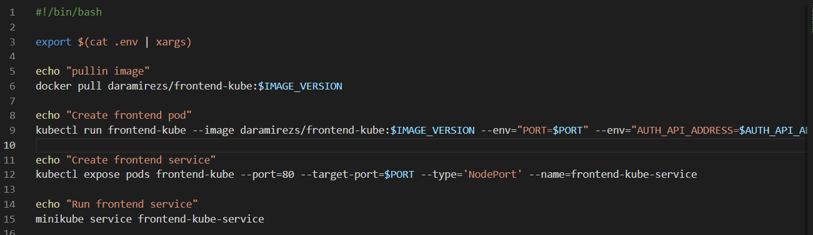

# Complete Kubernetes workshop

Run pod


```
kubectl expose pods my-nginx --port=80 --target-port=80 --type='NodePort' --name=my-nginx-service
```


To start the service: 
```
$ minikube service my-nginx-service
```


## Delete the resources

```
$ kubectl delete service <service_name>
```


```
$ kubectl delete pod <pod_name>
```


# Create a Namespace, a Pod and a Service using a YAML file

Create a new yaml [file](../../k8s-first-steps-ws/1.pod.yaml) inside the master node of the cluster and run the command: 
```
$ kubectl apply -f name_of_file.yaml
```

## Check that all the resources were created

Namespace created:


Pods:


Services:


#  What is a LoadBalancer service? When should I use it against a ClusterIP?

There are four types of Kubernetes services: ClusterIP, NodePort, LoadBalancer and ExternalName.

## ClusterIP
* ClusterIP is the default and most common service type.
Kubernetes will assign a cluster-internal IP address to 

* ClusterIP service. This makes the service only reachable within the cluster.

* You cannot make requests to service (pods) from outside the cluster.

* You can optionally set cluster IP in the service definition file.

## NodePort

* NodePort service is an extension of ClusterIP service. A ClusterIP Service, to which the NodePort Service routes, is automatically created.

* NodePort exposes the service on each Node’s IP at a static port (the NodePort). Each node proxies that port into your Service. So, external traffic has access to fixed port on each Node. It means any request to your cluster on that port gets forwarded to the service.

* You can contact the NodePort Service, from outside the cluster, by requesting <\NodeIP>:<\NodePort>.

* Using a NodePort gives you the freedom to set up your own load balancing solution, to configure environments that are not fully supported by Kubernetes, or even to expose one or more nodes’ IPs directly.

## Load Balancer

* LoadBalancer service is an extension of NodePort service. NodePort and ClusterIP Services, to which the external load balancer routes, are automatically created.

* It exposes the Service externally using a cloud provider’s load balancer.

* Traffic from the external load balancer is directed at the backend Pods. The cloud provider decides how it is load balanced.

* Every time you want to expose a service to the outside world, you have to create a new LoadBalancer and get an IP address.

## ExternalName

* Services of type ExternalName map a Service to a DNS name, not to a typical selector such as my-service.

* It maps the Service to the contents of the externalName field (e.g. foo.bar.example.com), by returning a CNAME record with its value.

### Use cases 
* This is commonly used to create a service within Kubernetes to represent an external datastore like a database that runs externally to Kubernetes.

* You can use that ExternalName service (as a local service) when Pods from one namespace to talk to a service in another namespace.

## LoadBalancer vs Cluster IP

A load balancer is for external connections and the Cluster Ip service only allows the connections between the cluster.

# To-Do application

Create script to automate the creation of the pods and the services



We can define an env file to set our variables and implement better practices.


Testing the application


